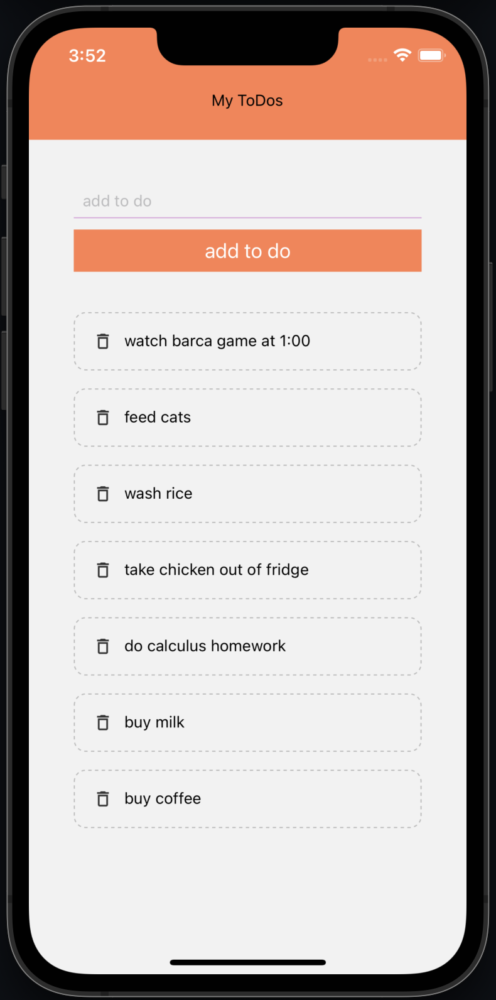
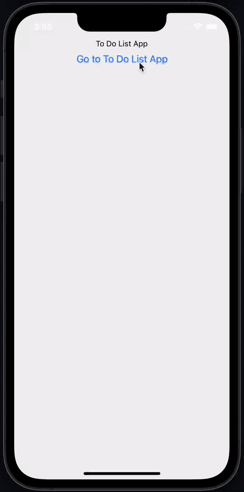

# To Do List App

Created a to do list app that allows user to add and delete items from the screen. Learned how to create and use components and use state management to update to do lists. Also learned stack navigation by adding a homescreen to the app.

\*see demo at bottom

